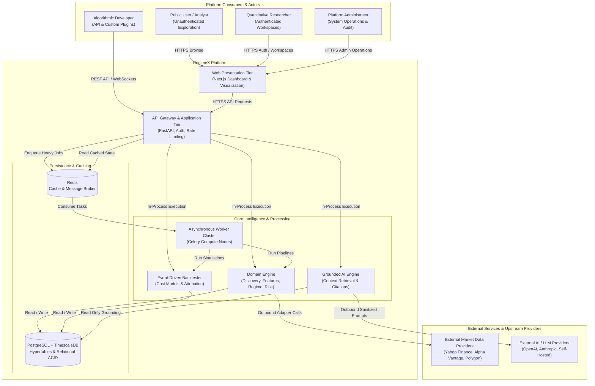
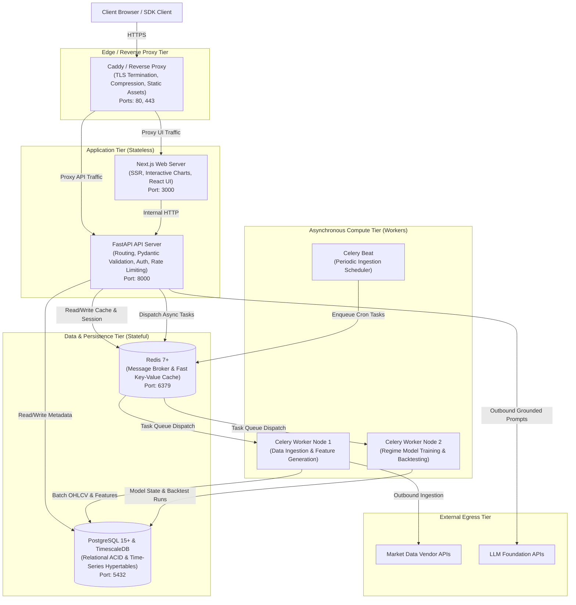
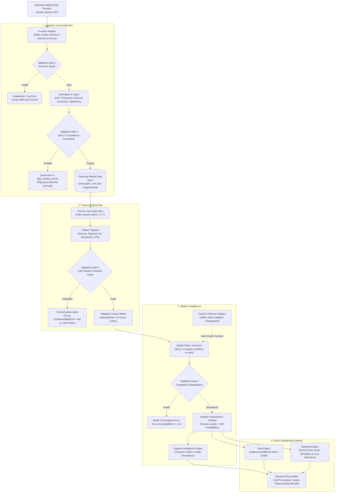
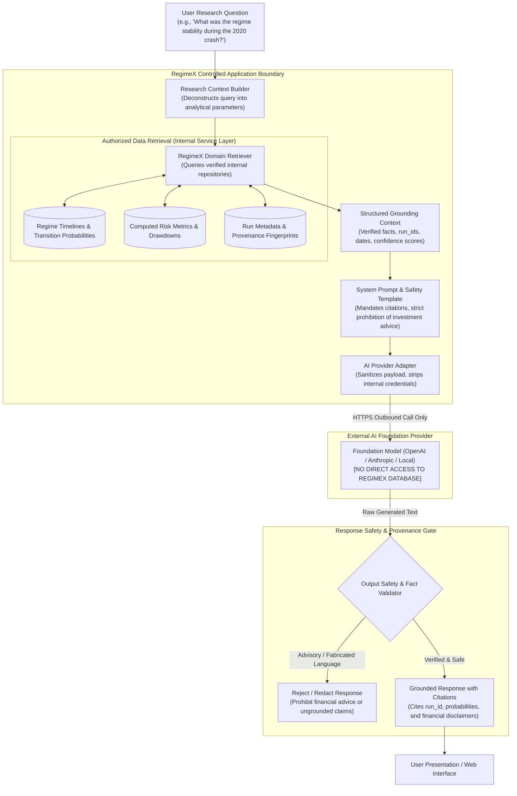
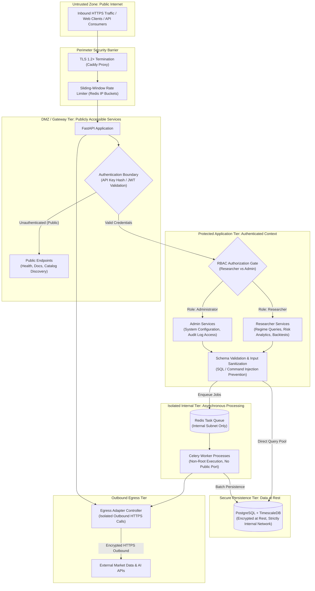

# RegimeX Architecture Diagrams

**RegimeX — Open-Source Market Intelligence Platform**  
**Volume:** V03 — System Architecture  
**Status:** Approved Architecture Blueprint  

---

## 1. Overview

This document provides formal architectural diagrams for RegimeX using standard Mermaid and structured ASCII representations. These diagrams illustrate system context, runtime container architecture, quantitative data pipeline validation gates, grounded AI workflows, and multi-tier security boundaries.

---

## 2. System Context Diagram

The System Context diagram illustrates RegimeX's external actors, consumer boundaries, core platform capabilities, and third-party foundation integrations.

---

## 3. Container & Runtime Architecture

The Container Architecture details the logical processes, network segregation, and execution boundaries between synchronous user paths and asynchronous compute workers.

---

## 4. Market Intelligence Pipeline (Validation Gates)

The Market Intelligence Pipeline enforces sequential data integrity checks and strict point-in-time constraints from raw external ingestion through quantitative modeling to risk analytics.

---

## 5. Grounded AI Research Pipeline

The Grounded AI Architecture ensures that external foundation models have **zero direct database access** and are strictly constrained by verified analytical facts and anti-financial-advice guardrails.

---

## 6. Security & Trust Boundaries

The Security Architecture diagram maps the concentric trust perimeters, authentication checkpoints, and data access policies from the public perimeter to isolated internal storage.

